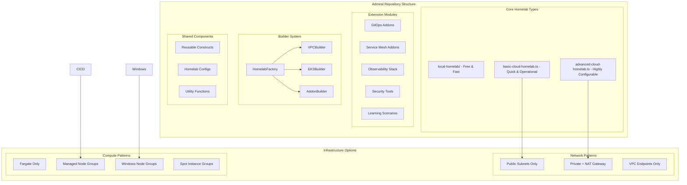

# Design Document

## Overview

Admiral is architected as a multi-tool monolithic repository that leverages AWS CDK as the primary infrastructure orchestrator while integrating specialized tools for specific use cases. The design prioritizes rapid deployment cycles, cost efficiency, and selective feature enablement through a flexible homelab factory system.

The architecture follows a builder pattern approach where different homelab types can be easily scaffolded with appropriate configurations:

- **Infrastructure Layer**: AWS CDK with builder patterns for VPC, EKS, and addon configurations
- **Homelab Types**: Pre-configured homelab patterns for different use cases and learning scenarios
- **Platform Layer**: Selective addon deployment based on homelab requirements
- **Application Layer**: Kustomize overlays and raw YAML manifests for scenario-specific deployments
- **Configuration Layer**: Ansible playbooks for post-deployment configuration and setup
- **Image Layer**: Packer templates for custom AMI and container image builds

## Architecture

### Homelab Factory System



### Core Homelab Foundation Types

Admiral provides three foundational homelab types that serve as starting points for different user needs and can be extended with additional components and customizations.

#### Local Homelab (`local-homelab/`)

- **Purpose**: Cost-free local development and learning environment
- **Target User**: Developers learning Kubernetes basics, testing configurations offline
- **Infrastructure**: Vagrant VMs with configurable CPU/memory resources
- **Kubernetes**: k3s (lightweight) or kind (Docker-based) clusters
- **Networking**: Local networking with port forwarding for service access
- **Addons**: Minimal - basic ingress controller, local storage
- **Limitations**: No cloud-native services, limited to local resources, basic networking
- **Extension Points**: Can add local monitoring, sample applications, debugging scenarios
- **Use Case**: Free experimentation, offline development, learning Kubernetes fundamentals

#### Basic Cloud Homelab (`basic-cloud-homelab.ts`)

- **Purpose**: Quick, operational, cost-effective cloud-native cluster
- **Target User**: Users wanting to quickly get hands-on with cloud-native CNCF tools
- **Network**: Public subnets only (no NAT gateway costs), single AZ option for cost savings
- **Compute**: Fargate profiles for system pods, single small managed node group
- **Addons**: Essential cloud-native stack - AWS Load Balancer Controller, cert-manager, basic observability
- **Cost Optimization**: Aggressive cost controls, auto-shutdown, minimal resource allocation
- **Extension Points**: Can add GitOps (Flux/ArgoCD), service mesh, enhanced monitoring, CI/CD pipelines
- **Use Case**: Learning cloud-native patterns, testing CNCF tools, quick experimentation with AWS services

#### Advanced Cloud Homelab (`advanced-cloud-homelab.ts`)

- **Purpose**: Highly configurable foundation for complex scenarios and production-like testing
- **Target User**: Platform engineers, advanced users building sophisticated lab environments
- **Network**: Fully configurable - private/public subnets, multiple VPC patterns, VPC peering/TGW support for multi-cluster scenarios
- **Compute**: Flexible compute patterns - multiple node groups, Windows support, custom launch templates
- **Networking Options**:
  - Single VPC with private/public subnets
  - Multi-VPC with peering for cluster-to-cluster communication
  - Transit Gateway integration for complex networking scenarios
  - VPC endpoints for cost optimization
- **Addon Framework**: Comprehensive addon system with dependency management
- **Extension Points**:
  - Multi-cluster deployments
  - Cross-VPC networking scenarios
  - Advanced security configurations
  - Custom networking patterns
  - Integration with other AWS services (RDS, ElastiCache, etc.)
- **Use Case**: Production-like testing, complex networking scenarios, multi-cluster patterns, advanced CNCF integrations

### Extension and Customization System

Each foundational homelab type serves as a base that can be extended with:

#### Addon Modules

- **GitOps**: Flux or ArgoCD for application deployment
- **Service Mesh**: Linkerd or Istio for advanced traffic management
- **Observability**: Prometheus, Grafana, Jaeger for comprehensive monitoring
- **Security**: Falco, OPA Gatekeeper, network policies
- **Storage**: EBS/EFS CSI drivers, backup solutions
- **CI/CD**: Jenkins, Tekton, GitHub Actions runners

#### Scenario Packages

- **Debugging Scenarios**: Broken applications and troubleshooting exercises
- **Performance Testing**: Load testing tools and scenarios
- **Security Testing**: Vulnerability scanning and penetration testing setups
- **Disaster Recovery**: Backup and restore scenarios

#### Networking Extensions (Advanced Homelab)

- **Multi-Cluster**: EKS clusters across different VPCs with peering
- **Hybrid Connectivity**: VPN or Direct Connect simulation
- **Service Discovery**: Cross-cluster service discovery patterns
- **Traffic Management**: Advanced ingress and egress patterns

### Deployment Speed Optimizations

The design implements several strategies to minimize deployment time:

1. **Fargate-First System Pods**: Critical system components run on Fargate to eliminate node group boot time dependency
2. **Parallel Stack Deployment**: Independent stacks deploy concurrently using CDK's built-in parallelization
3. **Managed Addons**: Leverage AWS-managed EKS addons for VPC CNI, CoreDNS, and kube-proxy
4. **Pre-built Launch Templates**: Node groups use optimized launch templates with EKS-optimized AMIs
5. **Lambda-based Helm Deployment**: CDK's HelmChart construct uses Lambda functions for faster chart installation

## Components and Interfaces

### Homelab Factory Pattern

#### HomelabFactory

- **Purpose**: Central factory for creating different homelab configurations
- **Interface**:

```typescript
class HomelabFactory {
  static createLocalHomelab(
    scope: Construct,
    props: LocalHomelabProps
  ): LocalHomelab;
  static createBasicCloudHomelab(
    scope: Construct,
    props: BasicCloudHomelabProps
  ): BasicCloudHomelab;
  static createAdvancedCloudHomelab(
    scope: Construct,
    props: AdvancedCloudHomelabProps
  ): AdvancedCloudHomelab;

  // Extension methods for adding modules to any homelab type
  static addGitOpsModule(homelab: CloudHomelab, config: GitOpsConfig): void;
  static addServiceMeshModule(homelab: CloudHomelab, config: ServiceMeshConfig): void;
  static addObservabilityModule(homelab: CloudHomelab, config: ObservabilityConfig): void;
  static addSecurityModule(homelab: CloudHomelab, config: SecurityConfig): void;
  ): WindowsHomelab;
  static createCICDHomelab(
    scope: Construct,
    props: CICDHomelabProps
  ): CICDHomelab;
  static createServiceMeshHomelab(
    scope: Construct,
    props: ServiceMeshHomelabProps
  ): ServiceMeshHomelab;
  static createObservabilityHomelab(
    scope: Construct,
    props: ObservabilityHomelabProps
  ): ObservabilityHomelab;
}
```

#### VPCBuilder

- **Purpose**: Flexible VPC configuration based on homelab requirements
- **Options**:
  - Public-only (cost-optimized)
  - Private with NAT gateway (security-focused)
  - VPC endpoints only (hybrid approach)
- **Interface**:

```typescript
interface VPCBuilderProps {
  pattern: "public-only" | "private-nat" | "vpc-endpoints";
  azCount: number;
  enableFlowLogs: boolean;
  costOptimized: boolean;
}
```

#### EKSBuilder

- **Purpose**: Configurable EKS cluster creation with different compute patterns
- **Options**:
  - Fargate-only (serverless)
  - Managed node groups (traditional)
  - Mixed compute (hybrid)
  - Windows support (multi-OS)
- **Interface**:

```typescript
interface EKSBuilderProps {
  computePattern: "fargate-only" | "managed-nodes" | "mixed" | "windows";
  nodeGroupConfigs: NodeGroupConfig[];
  fargateProfiles: FargateProfileConfig[];
  managedAddons: ManagedAddonConfig[];
}
```

#### AddonBuilder

- **Purpose**: Selective addon deployment based on homelab type
- **Features**:
  - Dependency resolution
  - Conditional deployment
  - Configuration validation
- **Interface**:

```typescript
interface AddonBuilderProps {
  addons: AddonConfig[];
  cluster: eks.Cluster;
  dependencies: AddonDependency[];
}
```

### Multi-Tool Integration Layer

#### Kubernetes Manifest Management

```
k8s/
├── scenarios/               # Different learning scenarios
│   ├── basic/              # Basic Kubernetes resources
│   ├── debugging/          # Broken apps for practice
│   ├── performance/        # Load testing scenarios
│   └── security/           # Security testing scenarios
├── overlays/
│   ├── basic-homelab/      # Basic homelab overrides
│   ├── advanced-homelab/   # Advanced homelab overrides
│   ├── windows-homelab/    # Windows-specific overrides
│   └── local-homelab/      # Local environment overrides
└── raw/                    # Raw YAML for kubectl apply
```

#### Local Homelab Integration

```
local-homelab/
├── Vagrantfile             # VM configuration and provisioning
├── ansible/
│   ├── site.yml           # Main playbook for local setup
│   ├── inventory/
│   │   └── local          # Local VM inventory
│   ├── roles/
│   │   ├── k3s-cluster/   # k3s installation and setup
│   │   ├── kind-cluster/  # kind cluster alternative
│   │   ├── docker/        # Docker installation
│   │   └── monitoring/    # Local monitoring stack
│   └── group_vars/
│       └── all.yml        # Local homelab configuration
├── scripts/
│   ├── setup.sh           # Initial setup script
│   ├── destroy.sh         # Cleanup script
│   └── port-forward.sh    # Service access helper
└── configs/
    ├── k3s/               # k3s-specific configurations
    └── kind/              # kind-specific configurations
```

#### Ansible Integration

```
ansible/
├── playbooks/
│   ├── aws-homelab-setup/ # AWS homelab-specific setup
│   ├── local-homelab-setup/ # Local homelab setup
│   ├── app-scenarios/     # Application deployment scenarios
│   └── debugging-prep/    # Debugging scenario preparation
├── inventory/
│   ├── aws-homelabs/      # AWS homelab inventories
│   └── local-homelabs/    # Local homelab inventories
└── roles/
    ├── k8s-tools/         # kubectl, helm, etc.
    ├── aws-config/        # AWS-specific configuration
    └── local-config/      # Local environment configuration
```

## Data Models

### Homelab Configuration Schema

```typescript
interface HomelabConfig {
  name: string;
  type: "local" | "basic-cloud" | "advanced-cloud";
  account: string;
  region: string;

  // Network configuration
  network: {
    pattern: "public-only" | "private-nat" | "vpc-endpoints";
    azCount: number;
    enableFlowLogs: boolean;
  };

  // Compute configuration
  compute: {
    pattern: "fargate-only" | "managed-nodes" | "mixed" | "windows";
    nodeGroups: NodeGroupConfig[];
    fargateProfiles: FargateProfileConfig[];
  };

  // Addon selection
  addons: {
    [addonName: string]: AddonConfig;
  };

  // Cost controls
  costControls: {
    autoShutdown: boolean;
    ttlHours: number;
    budgetAlerts: boolean;
    tags: Record<string, string>;
  };
}

interface NodeGroupConfig {
  name: string;
  instanceTypes: string[];
  capacityType: "ON_DEMAND"; // Removed spot instances per feedback
  desired: number;
  min: number;
  max: number;
  taints?: NodeTaint[];
  labels?: Record<string, string>;
}

interface LocalHomelabConfig {
  name: string;
  type: "local";

  // VM configuration
  vms: {
    count: number;
    cpus: number;
    memory: number; // MB
    disk: number; // GB
  };

  // Kubernetes configuration
  kubernetes: {
    distribution: "k3s" | "kind";
    version: string;
    features: {
      ingress: boolean;
      monitoring: boolean;
      storage: boolean;
    };
  };

  // Network configuration
  network: {
    subnet: string;
    portForwarding: PortForwardConfig[];
  };

  // Tool selection
  tools: {
    docker: boolean;
    helm: boolean;
    kubectl: boolean;
    monitoring: boolean;
  };
}

interface PortForwardConfig {
  name: string;
  hostPort: number;
  guestPort: number;
  protocol: "tcp" | "udp";
}
```

### Addon Configuration Model

```typescript
interface AddonConfig {
  enabled: boolean;
  deploymentMethod: "cdk-helm" | "helm-cli" | "kustomize" | "kubectl";
  values?: Record<string, any>;
  valuesFile?: string;
  dependencies?: string[];
  namespace?: string;
  homelabTypes?: string[]; // Which homelab types include this addon
}
```

## Error Handling

### Deployment Failure Recovery

1. **Stack Rollback**: CDK automatically rolls back failed stacks
2. **Addon Retry Logic**: Helm releases include retry mechanisms with exponential backoff
3. **Dependency Validation**: Pre-deployment checks ensure prerequisites are met for each homelab type
4. **Resource Cleanup**: Failed deployments trigger automatic cleanup of partial resources

### Cost Protection Mechanisms

1. **Resource Tagging**: All resources tagged with homelab type, TTL, and cost allocation tags
2. **Automated Shutdown**: Lambda functions monitor and shutdown expired resources based on TTL tags
3. **Budget Alerts**: CloudWatch alarms and SNS notifications for cost thresholds
4. **Deployment Limits**: Configuration validation prevents oversized deployments for homelab use

### Homelab-Specific Error Handling

1. **Configuration Validation**: Validate homelab configuration before deployment
2. **Dependency Checking**: Ensure required addons are available for specific homelab types
3. **Resource Conflict Detection**: Prevent conflicting configurations (e.g., multiple service meshes)
4. **Rollback Strategies**: Homelab-specific rollback procedures for different failure scenarios

## Testing Strategy

### Infrastructure Testing

1. **CDK Unit Tests**: Jest tests for each homelab type and builder component
2. **Integration Tests**: Deploy each homelab type to isolated test environment
3. **Security Tests**: cdk-nag integration with homelab-specific security rules
4. **Performance Tests**: Measure deployment times for each homelab type and optimize bottlenecks

### Homelab Validation Testing

1. **Configuration Tests**: Validate all homelab configurations produce valid CDK code
2. **Deployment Tests**: Automated deployment and teardown of each homelab type
3. **Addon Compatibility Tests**: Verify addon combinations work correctly for each homelab
4. **Cross-Homelab Tests**: Ensure shared components work across different homelab types

### GitHub Actions CI/CD Testing

1. **Lint and Format**: ESLint, Prettier validation for all TypeScript code
2. **Unit Tests**: Run Jest tests for all components and homelab types
3. **CDK Synth**: Validate CDK synthesis for all homelab configurations
4. **Security Scanning**: cdk-nag checks and dependency vulnerability scanning
5. **Performance Benchmarking**: Track deployment time improvements over time

### Learning Scenario Testing

1. **Debugging Scenarios**: Validate broken applications deploy correctly for practice
2. **Performance Scenarios**: Load testing applications work as expected
3. **Security Scenarios**: Security testing scenarios function properly
4. **Documentation Testing**: Ensure all homelab documentation is accurate and up-to-date

## Performance Optimizations

### Deployment Speed Enhancements

1. **Concurrent Operations**: Parallel deployment of independent homelab components
2. **Resource Pre-warming**: Fargate profiles eliminate cold start delays
3. **Image Optimization**: Pre-pulled images and ECR caching strategies
4. **Network Optimization**: VPC CNI prefix delegation for faster pod networking
5. **Homelab-Specific Optimizations**: Each homelab type optimized for its specific use case

### Cost Optimization Strategies

1. **Right-sizing**: Homelab-specific instance type recommendations
2. **Resource Scheduling**: Automatic shutdown of homelab environments based on usage patterns
3. **Storage Optimization**: EBS GP3 volumes with optimized IOPS allocation
4. **Network Cost Optimization**: Public-only networking option for cost-sensitive scenarios

### Operational Efficiency

1. **Configuration Management**: Centralized homelab configuration with validation
2. **Monitoring Integration**: Built-in observability for deployment and runtime metrics
3. **Automation**: Projen tasks for homelab-specific operations and maintenance
4. **Documentation**: Auto-generated documentation for each homelab type and configuration option
